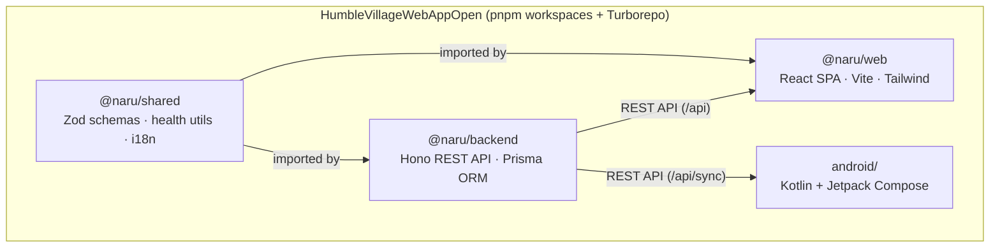
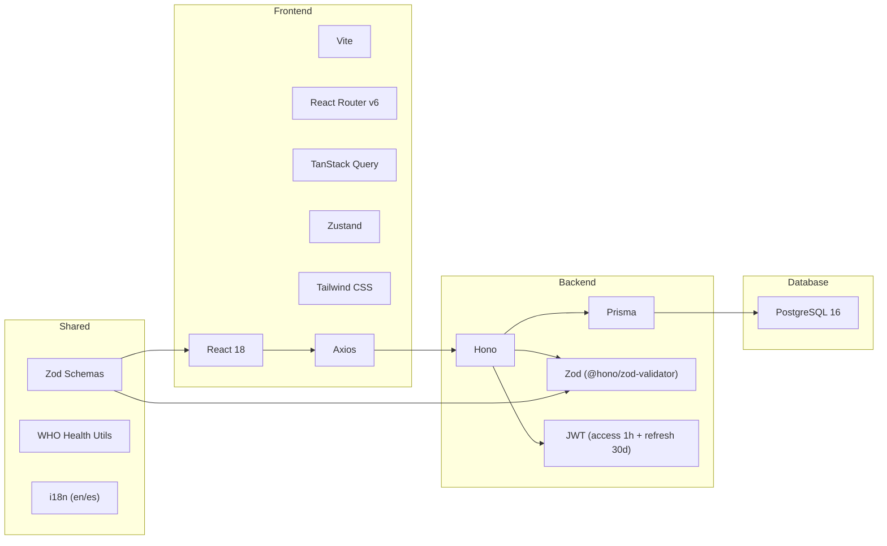
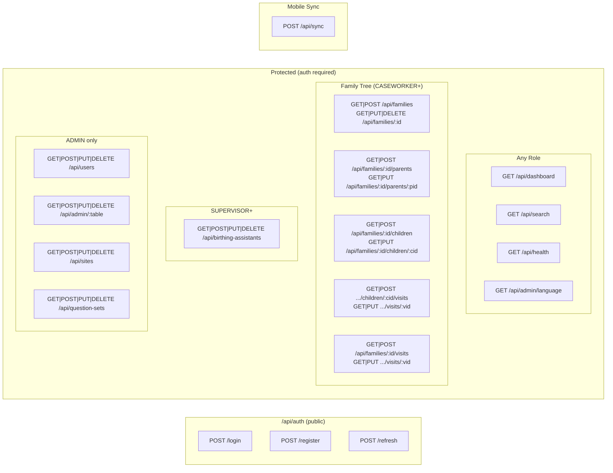
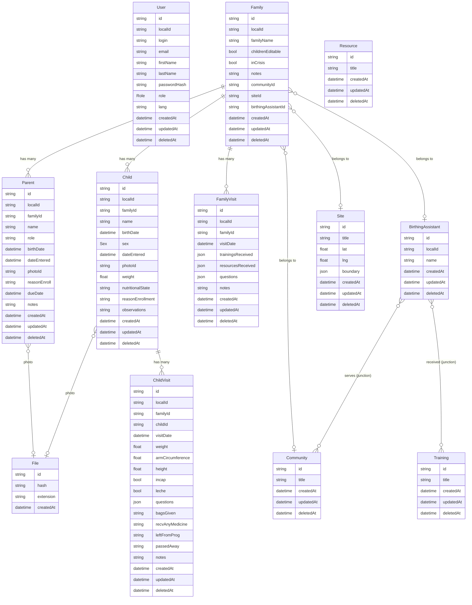
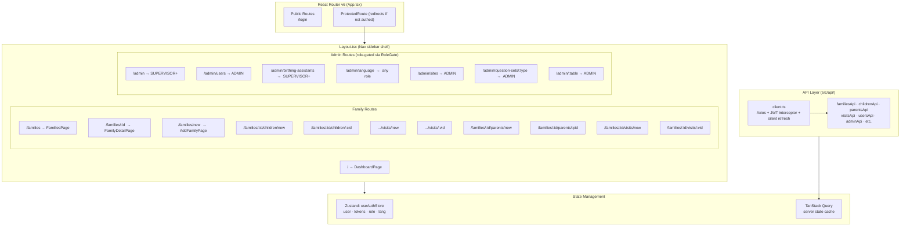
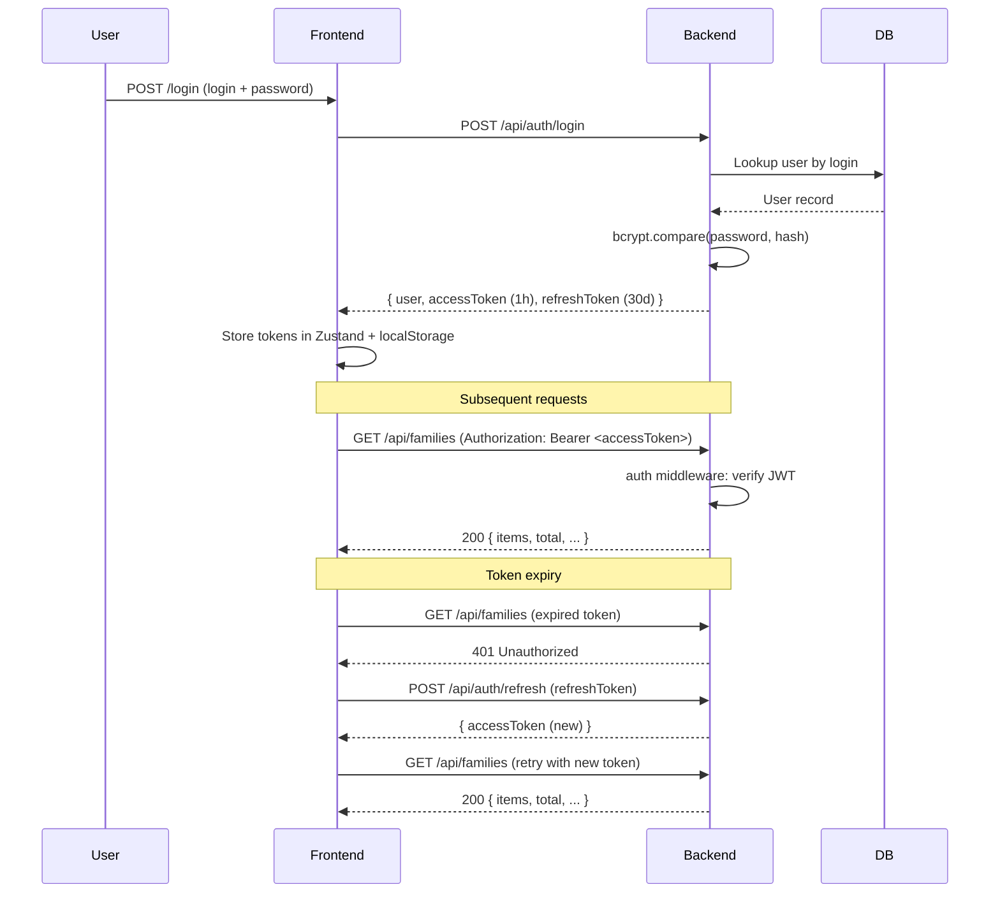
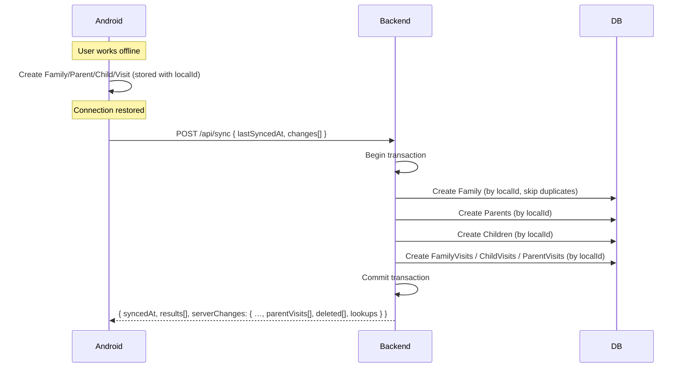
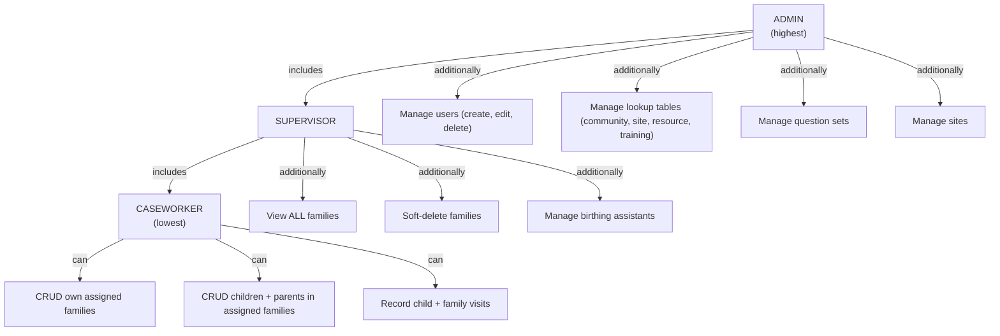
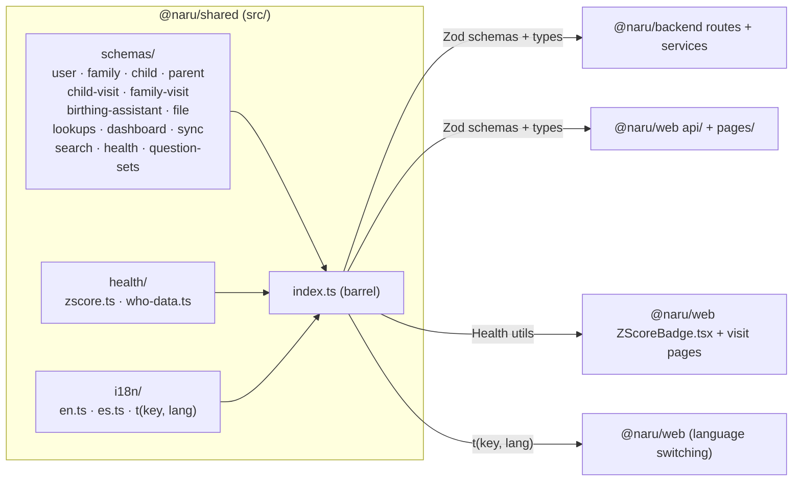

# Architecture

## System Overview

NaruProject is a full-stack family health tracking system for community health workers ("Humble Village"). It is a pnpm + Turborepo monorepo with three packages: a shared validation/i18n library, a Hono REST API backend, and a React SPA frontend. An Android app (Kotlin + Jetpack Compose) exists as a separate Gradle project.

---

## Monorepo Package Diagram

---

## Tech Stack

---

## Backend Architecture

```mermaid
graph TD
    Request["HTTP Request"]

    subgraph Middleware["Middleware Chain"]
        Auth["auth.ts<br/>JWT → c.var.user"]
        Role["role.ts<br/>requireRole / requireAdmin / requireSupervisor"]
        SoftDel["soft-delete.ts<br/>Prisma middleware (auto-filter deletedAt)"]
    end

    subgraph Routes["Route Handlers (src/routes/)"]
        AuthR["auth.ts"]
        FamiliesR["families.ts"]
        ChildrenR["children.ts"]
        ParentsR["parents.ts"]
        ChildVisitsR["child-visits.ts"]
        FamilyVisitsR["family-visits.ts"]
        UsersR["users.ts"]
        AdminR["admin.ts"]
        DashboardR["dashboard.ts"]
        SearchR["search.ts"]
        FilesR["files.ts"]
        SyncR["sync.ts"]
        BAR["birthing-assistants.ts"]
        QSetsR["question-sets.ts"]
        SitesR["sites.ts"]
        end

    subgraph Services["Service Layer (src/services/)"]
        AuthS["auth.service.ts"]
        FamilyS["family.service.ts"]
        ChildS["child.service.ts"]
        ParentS["parent.service.ts"]
        ChildVisitS["child-visit.service.ts"]
        FamilyVisitS["family-visit.service.ts"]
        UserS["user.service.ts"]
        AdminS["admin.service.ts"]
        DashS["dashboard.service.ts"]
        SearchS["search.service.ts"]
        FileS["file.service.ts"]
        SyncS["sync.service.ts"]
        BAS["birthing-assistant.service.ts"]
        QSetS["question-set.service.ts"]
        SiteS["site.service.ts"]
    end

    DB["Prisma Client (db.ts) → PostgreSQL"]

    Request --> Auth --> Role --> SoftDel
    SoftDel --> Routes
    Routes --> Services --> DB
```

---

## API Routes

---

## Database Schema

---

## Frontend Architecture

---

## Authentication Flow

---

## Mobile Sync Flow

### Client contract

**Push** — `changes[]` carries `create` only; edits and deletes are online-only.
Syncable entities: `family`, `parent`, `child`, `familyVisit`, `childVisit`,
`parentVisit`, `birthingAssistant`. The server sorts a batch into dependency
order itself, so send order doesn't matter.

Records created offline have no server ids, so foreign keys are named by
localId instead:

- `parentLocalId` on the change — the owning **Family** (legacy, still honoured)
- `localRefs: { familyId?, parentId?, childId? }` — any of those columns, by the
  target record's localId

Each reference resolves against the current batch first, then the database, so
retrying a batch whose earlier half already committed is safe (those changes come
back as `already_exists`).

**Pull** — `serverChanges` holds every record with `updatedAt > lastSyncedAt`,
plus all lookup tables in full, plus `deleted[]`: tombstones
(`{ entity, id, localId, deletedAt }`) for records soft-deleted since
`lastSyncedAt`. Soft-deleted rows are filtered out of every other array, so a
client that ignores `deleted[]` keeps deleted records forever. `deleted[]` is
empty on a first sync (`lastSyncedAt: null`), since there is nothing local to
drop. Tombstones cover the lookup tables too.

---

## RBAC (Role-Based Access Control)

---

## Shared Package Dependency Graph

